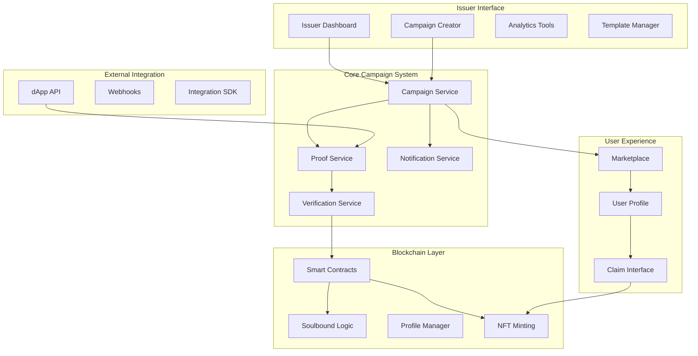
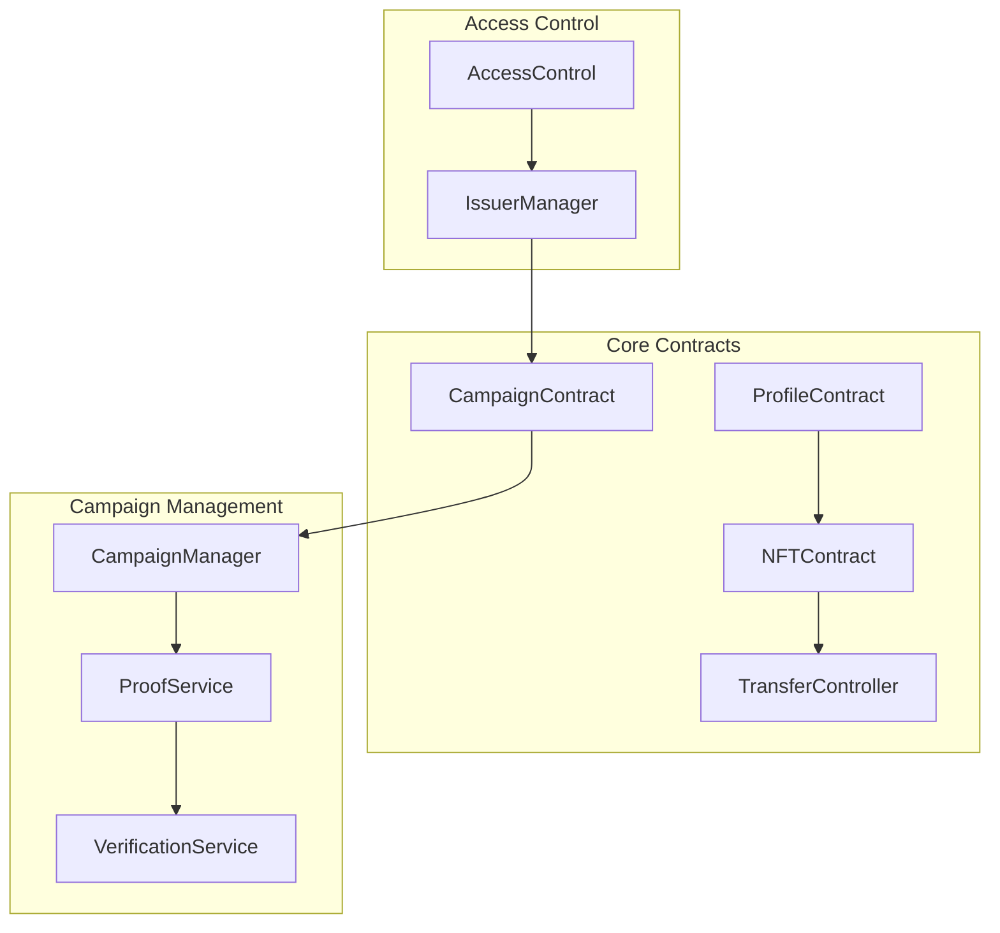

# Enhanced Issuer Experience Design

## Overview

The Enhanced Issuer Experience system transforms the traditional direct-issuance model into a sophisticated claimable NFT platform where issuers create achievement campaigns that users can complete and mint themselves. This design enables scalable quest systems, dApp integrations, and maintains reputation integrity through soulbound NFTs while providing issuers with comprehensive tools for campaign management and analytics.

## Architecture

### High-Level System Architecture



### Smart Contract Architecture



## Components and Interfaces

### 1. Campaign Management System

#### Campaign Creator Interface
```typescript
interface CampaignCreator {
  // Campaign Configuration
  createCampaign(config: CampaignConfig): Promise<Campaign>
  updateCampaign(id: string, updates: Partial<CampaignConfig>): Promise<Campaign>
  deleteCampaign(id: string): Promise<void>
  
  // Template Management
  saveTemplate(template: CampaignTemplate): Promise<Template>
  loadTemplate(id: string): Promise<Template>
  listTemplates(): Promise<Template[]>
  
  // Bulk Operations
  createBulkCampaigns(configs: CampaignConfig[]): Promise<Campaign[]>
  importFromCSV(file: File): Promise<CampaignConfig[]>
}

interface CampaignConfig {
  name: string
  description: string
  category: string
  nftMetadata: NFTMetadata
  claimConditions: ClaimCondition[]
  transferable: boolean // Default: false (soulbound)
  maxClaims?: number
  startTime?: Date
  endTime?: Date
  requiredProof: ProofType
}

interface ClaimCondition {
  type: 'task_completion' | 'verification' | 'time_based' | 'custom'
  parameters: Record<string, any>
  verificationMethod: 'signature' | 'api_call' | 'manual'
}
```

#### Campaign Service
```typescript
interface CampaignService {
  // Campaign Lifecycle
  deployContract(campaign: Campaign): Promise<string>
  activateCampaign(id: string): Promise<void>
  pauseCampaign(id: string): Promise<void>
  
  // User Interaction
  checkEligibility(campaignId: string, userAddress: string): Promise<EligibilityResult>
  generateClaimProof(campaignId: string, userAddress: string, evidence: any): Promise<ClaimProof>
  
  // Analytics
  getCampaignStats(id: string): Promise<CampaignStats>
  getUserProgress(campaignId: string, userAddress: string): Promise<UserProgress>
}
```

### 2. Proof Generation and Verification System

#### Proof Service
```typescript
interface ProofService {
  // EIP-712 Signature Generation
  generateMintProof(request: MintRequest): Promise<MintProof>
  validateProof(proof: MintProof): Promise<boolean>
  
  // Claim Authorization
  authorizeClaimForUser(campaignId: string, userAddress: string, evidence: Evidence): Promise<Authorization>
  checkClaimStatus(campaignId: string, userAddress: string): Promise<ClaimStatus>
  
  // Security
  revokeProof(proofId: string): Promise<void>
  blacklistUser(userAddress: string, campaignId: string): Promise<void>
}

interface MintProof {
  signature: string
  nonce: number
  expiry: number
  campaignId: string
  recipient: string
  tokenURI: string
  transferable: boolean
}

interface Evidence {
  type: 'completion_data' | 'verification_token' | 'external_proof'
  data: any
  timestamp: number
  source: string
}
```

### 3. Soulbound NFT System

#### Transfer Controller
```typescript
interface TransferController {
  // Transfer Management
  setTransferability(tokenId: string, transferable: boolean): Promise<void>
  isTransferable(tokenId: string): Promise<boolean>
  
  // Soulbound Logic
  beforeTokenTransfer(from: string, to: string, tokenId: string): Promise<void>
  bindToProfile(tokenId: string, profileId: string): Promise<void>
  
  // Issuer Controls
  updateTransferPolicy(campaignId: string, policy: TransferPolicy): Promise<void>
  getTransferPolicy(campaignId: string): Promise<TransferPolicy>
}

interface TransferPolicy {
  defaultTransferable: boolean
  allowIssuerOverride: boolean
  requireApproval: boolean
  restrictions: TransferRestriction[]
}
```

### 4. dApp Integration System

#### Integration API
```typescript
interface IntegrationAPI {
  // Campaign Discovery
  listAvailableCampaigns(filters?: CampaignFilter): Promise<Campaign[]>
  getCampaignDetails(id: string): Promise<CampaignDetails>
  
  // User Progress
  getUserEligibleCampaigns(userAddress: string): Promise<Campaign[]>
  trackUserProgress(campaignId: string, userAddress: string, progress: ProgressUpdate): Promise<void>
  
  // Claim Process
  initiateClaim(campaignId: string, userAddress: string): Promise<ClaimSession>
  submitClaimEvidence(sessionId: string, evidence: Evidence): Promise<ClaimResult>
  
  // Webhooks
  registerWebhook(url: string, events: WebhookEvent[]): Promise<WebhookRegistration>
  unregisterWebhook(id: string): Promise<void>
}

interface ProgressUpdate {
  taskId: string
  status: 'started' | 'in_progress' | 'completed'
  data?: any
  timestamp: number
}
```

### 5. Analytics and Reporting System

#### Analytics Service
```typescript
interface AnalyticsService {
  // Campaign Analytics
  getCampaignMetrics(campaignId: string, timeRange: TimeRange): Promise<CampaignMetrics>
  getIssuerDashboard(issuerAddress: string): Promise<IssuerDashboard>
  
  // User Engagement
  getUserEngagementStats(campaignId: string): Promise<EngagementStats>
  getCompletionFunnel(campaignId: string): Promise<FunnelData>
  
  // Platform Analytics
  getPlatformOverview(): Promise<PlatformStats>
  generateReport(config: ReportConfig): Promise<Report>
}

interface CampaignMetrics {
  totalViews: number
  uniqueUsers: number
  completionRate: number
  averageTimeToComplete: number
  claimRate: number
  userRetention: number
}
```

## Data Models

### Campaign Data Model
```typescript
interface Campaign {
  id: string
  issuerAddress: string
  name: string
  description: string
  category: string
  
  // NFT Configuration
  nftMetadata: {
    name: string
    description: string
    image: string
    attributes: Attribute[]
  }
  
  // Claim Configuration
  claimConditions: ClaimCondition[]
  maxClaims: number
  currentClaims: number
  transferable: boolean
  
  // Lifecycle
  status: 'draft' | 'active' | 'paused' | 'completed' | 'cancelled'
  createdAt: Date
  startTime?: Date
  endTime?: Date
  
  // Smart Contract
  contractAddress?: string
  deploymentTx?: string
}
```

### User Progress Data Model
```typescript
interface UserProgress {
  campaignId: string
  userAddress: string
  status: 'not_started' | 'in_progress' | 'completed' | 'claimed'
  
  // Progress Tracking
  completedTasks: string[]
  currentTask?: string
  progressPercentage: number
  
  // Claim Information
  claimProof?: MintProof
  claimedAt?: Date
  tokenId?: string
  
  // Timestamps
  startedAt: Date
  lastUpdated: Date
}
```

## Error Handling

### Campaign Creation Errors
```typescript
enum CampaignError {
  INVALID_CLAIM_CONDITIONS = 'INVALID_CLAIM_CONDITIONS',
  INSUFFICIENT_PERMISSIONS = 'INSUFFICIENT_PERMISSIONS',
  DUPLICATE_CAMPAIGN = 'DUPLICATE_CAMPAIGN',
  INVALID_NFT_METADATA = 'INVALID_NFT_METADATA',
  CONTRACT_DEPLOYMENT_FAILED = 'CONTRACT_DEPLOYMENT_FAILED'
}
```

### Claim Process Errors
```typescript
enum ClaimError {
  NOT_ELIGIBLE = 'NOT_ELIGIBLE',
  ALREADY_CLAIMED = 'ALREADY_CLAIMED',
  CAMPAIGN_INACTIVE = 'CAMPAIGN_INACTIVE',
  INVALID_PROOF = 'INVALID_PROOF',
  CLAIM_LIMIT_REACHED = 'CLAIM_LIMIT_REACHED',
  EXPIRED_AUTHORIZATION = 'EXPIRED_AUTHORIZATION'
}
```

### Transfer Control Errors
```typescript
enum TransferError {
  SOULBOUND_TOKEN = 'SOULBOUND_TOKEN',
  TRANSFER_NOT_AUTHORIZED = 'TRANSFER_NOT_AUTHORIZED',
  INVALID_RECIPIENT = 'INVALID_RECIPIENT',
  PROFILE_NOT_BOUND = 'PROFILE_NOT_BOUND'
}
```

## Testing Strategy

### Unit Testing
- **Campaign Service**: Test campaign creation, validation, and lifecycle management
- **Proof Service**: Test signature generation, validation, and security measures
- **Transfer Controller**: Test soulbound logic and transfer restrictions
- **Analytics Service**: Test metric calculations and report generation

### Integration Testing
- **dApp Integration**: Test API endpoints, webhook delivery, and SDK functionality
- **Smart Contract Integration**: Test contract deployment and interaction
- **User Flow Testing**: Test complete claim process from discovery to minting
- **Cross-Campaign Testing**: Test user progress across multiple campaigns

### End-to-End Testing
- **Issuer Workflow**: Complete campaign creation and management process
- **User Claim Process**: Full user journey from task completion to NFT minting
- **dApp Integration**: External application integration and user experience
- **Analytics Pipeline**: Data collection, processing, and reporting accuracy

### Security Testing
- **Proof Validation**: Test signature verification and replay attack prevention
- **Access Control**: Test issuer permissions and unauthorized access prevention
- **Soulbound Enforcement**: Test transfer restrictions and bypass attempts
- **Rate Limiting**: Test API rate limits and abuse prevention

### Performance Testing
- **Bulk Operations**: Test large-scale campaign creation and management
- **Concurrent Claims**: Test system behavior under high claim volume
- **Analytics Queries**: Test dashboard performance with large datasets
- **Smart Contract Gas**: Test gas optimization for minting and transfers

## Security Considerations

### Proof Security
- **EIP-712 Signatures**: Use typed data signatures for secure authorization
- **Nonce Management**: Prevent replay attacks with unique nonces
- **Expiry Times**: Implement time-limited proofs to reduce attack windows
- **Signature Validation**: Comprehensive validation of all proof components

### Access Control
- **Issuer Authorization**: Verify issuer permissions for all operations
- **Campaign Ownership**: Ensure only campaign creators can modify campaigns
- **Admin Functions**: Restrict administrative functions to authorized accounts
- **Rate Limiting**: Implement rate limits to prevent abuse

### Smart Contract Security
- **Reentrancy Protection**: Use reentrancy guards for state-changing functions
- **Integer Overflow**: Use SafeMath or Solidity 0.8+ for arithmetic operations
- **Access Modifiers**: Proper use of public, private, and internal functions
- **Emergency Stops**: Implement pause functionality for emergency situations

### Data Privacy
- **User Data**: Minimize collection and storage of personal information
- **Evidence Storage**: Secure handling of user-submitted evidence
- **Analytics Privacy**: Aggregate data to protect individual user privacy
- **GDPR Compliance**: Implement data deletion and export capabilities