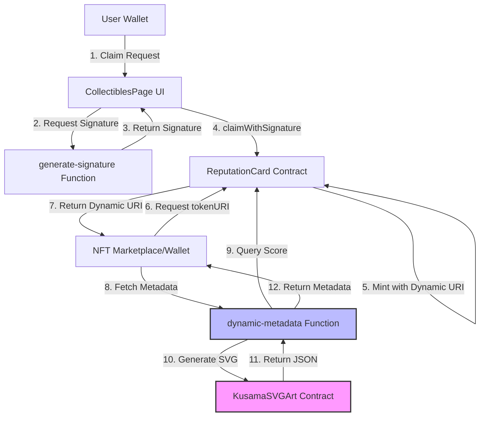

# Design Document: Kusama Living Profile

## Overview

The Kusama Living Profile is a dynamic NFT collectible that showcases a user's real-time on-chain reputation score through generative SVG art. Unlike traditional static NFTs, this collectible's visual representation updates automatically based on the user's current reputation, creating a "living" profile that evolves with their on-chain activity.

### Key Innovation

The innovation lies in the separation of concerns:
- **On-chain SVG generation**: A lightweight smart contract on Kusama Hub generates SVG art deterministically based on reputation scores
- **Dynamic metadata endpoint**: A serverless function serves as the tokenURI, querying the main chain for reputation data and calling the art contract for visualization
- **Existing infrastructure**: Leverages the existing ReputationCard contract and ProfileNFT system without modifications

This architecture ensures that the NFT metadata is always current without requiring on-chain updates or complex oracle systems.

## Architecture

### System Components



### Network Architecture

The system spans two networks:
1. **Main Network** (where ReputationCard is deployed): Handles profile management, reputation scoring, and NFT minting
2. **Kusama Hub** (Chain ID: 420420418): Hosts the KusamaSVGArt contract for generative art

### Data Flow

1. **Claiming Flow**:
   - User initiates claim from CollectiblesPage
   - Frontend requests signature from backend
   - User signs transaction with dynamic metadata URI
   - ReputationCard mints NFT with URI pointing to serverless function

2. **Metadata Resolution Flow**:
   - External service (marketplace/wallet) calls tokenURI on ReputationCard
   - Receives dynamic endpoint URL (e.g., `https://project.supabase.co/functions/v1/dynamic-metadata/{profileId}`)
   - Calls serverless function
   - Function queries reputation score from main chain
   - Function calls KusamaSVGArt on Kusama Hub
   - Returns complete JSON metadata with embedded SVG

## Components and Interfaces

### 1. KusamaSVGArt Smart Contract

**Location**: Kusama Hub (Chain ID: 420420418)

**Purpose**: Generate deterministic SVG art based on reputation scores

**Interface**:
```solidity
function generateSVG(uint256 score) public pure returns (string memory)
```

**Design Decisions**:
- **Pure function**: No state changes, making it gas-efficient and predictable
- **Score normalization**: Accepts any uint256 but normalizes to 0-100 range
- **Color coding**: 
  - Red (#FF0000): 0-29 (needs improvement)
  - Orange (#FFA500): 30-69 (building reputation)
  - Green (#00FF00): 70-100 (strong reputation)
- **Visual elements**:
  - Dark background (#1a1a1a) for modern aesthetic
  - Base circle in gray (#333) showing full range
  - Colored progress arc filling proportionally to score
  - Numeric score display
  - "Reputation Score" label
- **Output format**: Complete JSON metadata with base64-encoded SVG data URI

**Implementation Details**:
- Uses OpenZeppelin's Base64 library for encoding
- SVG dimensions: 200x200px for optimal display
- Circle radius: 80px with 20px stroke width
- Stroke-dasharray technique for progress visualization
- Helper function `uint2str` for number-to-string conversion

### 2. Dynamic Metadata Edge Function

**Location**: Supabase Edge Functions

**Endpoint**: `/functions/v1/dynamic-metadata/{tokenId}`

**Purpose**: Serve dynamic NFT metadata that reflects current reputation

**Request Flow**:
```typescript
GET /functions/v1/dynamic-metadata/123
↓
1. Extract tokenId from URL path
2. Map tokenId to profileId (for Living Profile, tokenId = profileId)
3. Query ReputationCard.calculateScoreForProfile(profileId)
4. Call KusamaSVGArt.generateSVG(score) on Kusama Hub
5. Parse and return JSON metadata
```

**Response Format**:
```json
{
  "name": "Kusama Living Profile",
  "description": "A dynamic profile NFT reflecting the user's on-chain reputation score.",
  "image": "data:image/svg+xml;base64,PHN2ZyB3aWR0aD0iMjAwIi..."
}
```

**Error Handling**:
- 400: Missing or invalid token ID
- 500: Contract call failures, network issues
- Detailed error messages in response body for debugging

**Environment Variables**:
- `REPUTATION_CARD_CONTRACT_ADDRESS`: Main chain contract address
- `KUSAMA_SVG_CONTRACT_ADDRESS`: Kusama Hub art contract address
- `SUPABASE_URL`: Supabase project URL
- `SUPABASE_ANON_KEY`: Supabase anonymous key

**Technology Stack**:
- Deno runtime for Edge Functions
- Viem for blockchain interactions
- Supabase client for database access (if needed for caching)

### 3. Database Schema Extension

**New Template Record**:

The `collectible_templates` table (or equivalent) will contain a special record for the Kusama Living Profile:

```sql
INSERT INTO collectible_templates (
  id,
  issuer_name,
  title,
  description,
  image_url,
  tier,
  template_id,
  token_uri_prefix
) VALUES (
  uuid_generate_v4(),
  'TrustFi Core Team',
  'Kusama Living Profile',
  'A dynamic collectible that reflects your real-time on-chain reputation score, powered by Kusama EVM.',
  'https://example.com/kusama_placeholder.png',
  3,
  999,
  'https://YOUR_PROJECT.supabase.co/functions/v1/dynamic-metadata/'
);
```

**Key Fields**:
- `template_id`: 999 (reserved for Kusama Living Profile)
- `tier`: 3 (highest tier, worth 200 points)
- `token_uri_prefix`: Points to dynamic metadata function
- `image_url`: Placeholder image for display before claiming

**Design Note**: The `token_uri_prefix` field is crucial. For template 999, it should point to the serverless function rather than an IPFS gateway.

### 4. Frontend Integration

**CollectiblesPage Component Modifications**:

The existing CollectiblesPage component needs minimal changes to support dynamic metadata:

**Detection Logic**:
```typescript
// In handleClaim function
if (templateId === 999) {
  // Use dynamic metadata URI
  metadataURI = `${dynamicTokenUriPrefix}${profileId}`;
} else {
  // Upload static metadata to IPFS
  const { data: pinResponse } = await supabase.functions.invoke('pin-metadata', {
    body: { metadata: metadataPayload }
  });
  metadataURI = `ipfs://${pinResponse.IpfsHash}`;
}
```

**Visual Indicators**:
- Badge or icon indicating "Dynamic NFT"
- Tooltip explaining that the visual updates with reputation
- Preview showing current reputation score

**User Experience**:
- Same claim flow as other collectibles
- Clear messaging about dynamic nature
- Link to view on-chain after claiming

### 5. ReputationCard Contract Integration

**No Modifications Required**: The existing ReputationCard contract already supports dynamic metadata through the `claimWithSignature` function, which accepts any `tokenURI_` string.

**Integration Points**:
- `claimWithSignature`: Accepts dynamic metadata URI
- `tokenURI`: Returns the stored URI (which points to serverless function)
- `calculateScoreForProfile`: Used by serverless function to get current score

**Template Configuration**:
The template for ID 999 must be created on-chain:
```solidity
createTemplate(
  999,                    // templateId
  ADMIN_ADDRESS,          // issuer
  0,                      // maxSupply (unlimited)
  3,                      // tier (highest)
  0,                      // startTime (immediate)
  0                       // endTime (no expiry)
)
```

## Data Models

### KusamaSVGArt Contract State

**No persistent state** - Pure function contract

### Dynamic Metadata Function State

**No persistent state** - Stateless serverless function

**Runtime Data**:
```typescript
interface MetadataRequest {
  tokenId: string;  // From URL path
}

interface MetadataResponse {
  name: string;
  description: string;
  image: string;  // Base64 data URI
}

interface ErrorResponse {
  error: string;
  details?: string;
}
```

### Database Models

**Existing Schema** (no changes):
- `collectible_templates`: Contains template 999 configuration
- `profiles`: Links wallets to profile IDs
- `claims_log`: Tracks claim events

**Template 999 Record**:
```typescript
interface KusamaTemplateRecord {
  id: string;
  issuer_name: 'TrustFi Core Team';
  title: 'Kusama Living Profile';
  description: string;
  image_url: string;  // Placeholder
  tier: 3;
  template_id: 999;
  token_uri_prefix: string;  // Dynamic endpoint URL
}
```

## Error Handling

### Smart Contract Errors

**KusamaSVGArt**:
- No revert conditions (pure function)
- Handles edge cases gracefully (score > 100 normalized)

**ReputationCard**:
- Standard validation errors (already implemented)
- "Template missing", "Already claimed", "Bad signature", etc.

### Serverless Function Errors

**Input Validation**:
```typescript
if (!tokenId) {
  return { status: 400, error: "Missing token ID" };
}
```

**Contract Call Failures**:
```typescript
try {
  const score = await reputationCardContract.read.calculateScoreForProfile([profileId]);
} catch (error) {
  return { 
    status: 500, 
    error: "Failed to read reputation score",
    details: error.message 
  };
}
```

**Network Issues**:
- Retry logic for transient failures
- Timeout handling (30s max)
- Fallback to cached data if available

### Frontend Error Handling

**Claim Errors**:
- Display user-friendly messages
- Distinguish between user errors (no profile) and system errors
- Provide actionable next steps

**Display Errors**:
- Graceful fallback to placeholder image
- Error state UI for failed metadata loads
- Retry mechanism for transient failures

## Testing Strategy

### Unit Tests

**KusamaSVGArt Contract**:
```javascript
describe("KusamaSVGArt", () => {
  it("should generate red SVG for low scores (0-29)");
  it("should generate orange SVG for medium scores (30-69)");
  it("should generate green SVG for high scores (70-100)");
  it("should normalize scores above 100");
  it("should return valid JSON metadata");
  it("should include base64-encoded SVG");
});
```

**Dynamic Metadata Function**:
```javascript
describe("dynamic-metadata", () => {
  it("should return 400 for missing token ID");
  it("should query reputation score correctly");
  it("should call SVG contract with correct score");
  it("should return valid JSON metadata");
  it("should handle contract call failures");
});
```

### Integration Tests

**End-to-End Claim Flow**:
1. Create test profile
2. Request signature for template 999
3. Execute claimWithSignature
4. Verify NFT minted with dynamic URI
5. Call tokenURI and verify format
6. Call dynamic metadata endpoint
7. Verify returned metadata matches current score

**Dynamic Update Verification**:
1. Claim Living Profile with initial score
2. Claim additional collectibles to increase score
3. Query metadata endpoint again
4. Verify SVG reflects new score
5. Verify color changes at thresholds

### Manual Testing

**Deployment Verification**:
- [ ] Deploy KusamaSVGArt to Kusama Hub testnet
- [ ] Verify generateSVG with various scores
- [ ] Deploy dynamic-metadata function
- [ ] Test endpoint with curl/Postman
- [ ] Verify cross-chain calls work

**UI Testing**:
- [ ] Verify template 999 displays correctly
- [ ] Test claim flow with and without profile
- [ ] Verify dynamic URI in transaction
- [ ] Check metadata display in wallet/marketplace
- [ ] Test error states and edge cases

**Performance Testing**:
- [ ] Measure metadata endpoint response time
- [ ] Test under concurrent load
- [ ] Verify gas costs for SVG generation
- [ ] Monitor cross-chain call latency

## Security Considerations

### Smart Contract Security

**KusamaSVGArt**:
- Pure function - no state manipulation risk
- No external calls - no reentrancy risk
- Deterministic output - no randomness vulnerabilities
- Input validation - score normalization prevents overflow

**ReputationCard Integration**:
- Existing security model unchanged
- Signature verification prevents unauthorized claims
- Soulbound nature prevents transfers

### Serverless Function Security

**Input Validation**:
- Sanitize token ID input
- Validate numeric ranges
- Prevent injection attacks

**Rate Limiting**:
- Implement per-IP rate limits
- Prevent DoS attacks
- Cache frequently accessed metadata

**Access Control**:
- Public read access (required for NFT standards)
- No write operations
- No sensitive data exposure

### Cross-Chain Security

**RPC Endpoint Trust**:
- Use official Kusama Hub RPC
- Implement fallback RPCs
- Verify response integrity

**Contract Address Verification**:
- Hardcode verified contract addresses
- Prevent address spoofing
- Document deployment addresses

## Deployment Plan

### Phase 1: Contract Deployment

1. **Install Dependencies**:
   ```bash
   npm install --save-dev hardhat @nomiclabs/hardhat-ethers ethers
   ```

2. **Configure Hardhat for Kusama Hub**:
   Add to `hardhat.config.ts`:
   ```typescript
   networks: {
     kusama: {
       url: "https://kusama-asset-hub-eth-rpc.polkadot.io",
       chainId: 420420418,
       accounts: [privateKey]
     }
   }
   ```

3. **Deploy KusamaSVGArt to Kusama Hub**:
   ```bash
   npx hardhat run scripts/deploy.js --network kusama
   # Verify on block explorer
   # Document contract address
   ```

2. **Create Template 999 On-Chain**:
   ```bash
   # Call createTemplate on ReputationCard
   # Verify template created
   # Test claimability
   ```

### Phase 2: Serverless Function Deployment

1. **Deploy dynamic-metadata Function**:
   ```bash
   supabase functions deploy dynamic-metadata
   ```

2. **Configure Environment Variables**:
   - Set contract addresses
   - Configure RPC URLs
   - Test connectivity

3. **Verify Function**:
   ```bash
   curl https://project.supabase.co/functions/v1/dynamic-metadata/1
   ```

### Phase 3: Database Configuration

1. **Insert Template Record**:
   ```sql
   -- Run template insertion script
   -- Verify record created
   -- Test frontend query
   ```

2. **Update Frontend Configuration**:
   ```typescript
   // Update SUPABASE_PROJECT_REF
   // Verify dynamic URI construction
   ```

### Phase 4: Frontend Integration

1. **Deploy Updated CollectiblesPage**:
   - Test template 999 detection
   - Verify dynamic URI usage
   - Test claim flow

2. **User Acceptance Testing**:
   - Test with real users
   - Gather feedback
   - Monitor for issues

### Phase 5: Monitoring and Optimization

1. **Set Up Monitoring**:
   - Function invocation metrics
   - Error rate tracking
   - Response time monitoring

2. **Optimize Performance**:
   - Implement caching if needed
   - Optimize contract calls
   - Reduce latency

## Performance Considerations

### Gas Optimization

**KusamaSVGArt**:
- Pure function - no gas cost for external calls
- Efficient string concatenation
- Minimal computation

**ReputationCard**:
- No additional gas cost vs. static metadata
- Same claim flow as existing templates

### Response Time Optimization

**Metadata Endpoint**:
- Target: < 2s response time
- Caching strategy for frequently accessed profiles
- Parallel contract calls where possible
- Connection pooling for RPC calls

**Frontend**:
- Lazy load metadata
- Show placeholder while loading
- Cache metadata client-side
- Prefetch for visible items

### Scalability

**Serverless Architecture**:
- Auto-scaling with demand
- No server management
- Pay-per-use pricing

**Contract Calls**:
- Read-only operations
- No state changes
- Highly cacheable

## Future Enhancements

### V2 Features

1. **Enhanced Visualizations**:
   - Multiple art styles based on score ranges
   - Animated SVGs
   - Seasonal themes

2. **Additional Metadata**:
   - Breakdown by tier
   - Recent activity indicators
   - Achievement badges

3. **Performance Optimizations**:
   - Metadata caching layer
   - CDN distribution
   - Batch queries for multiple profiles

4. **Cross-Chain Expansion**:
   - Deploy to additional Kusama parachains
   - Support multiple art contracts
   - User-selectable art styles

### Maintenance Considerations

**Contract Upgrades**:
- KusamaSVGArt is immutable (pure function)
- Can deploy new versions with different addresses
- Update metadata endpoint to support multiple art contracts

**Function Updates**:
- Serverless functions can be updated without downtime
- Version control for breaking changes
- Gradual rollout strategy

**Database Migrations**:
- Template records are append-only
- No schema changes required
- Backward compatible updates

## Conclusion

The Kusama Living Profile represents an innovative approach to dynamic NFTs, leveraging the strengths of both on-chain determinism and off-chain flexibility. By separating art generation (on Kusama Hub) from metadata serving (serverless function), we achieve a scalable, maintainable solution that provides real-time reputation visualization without complex on-chain updates.

The design integrates seamlessly with existing infrastructure, requiring no changes to core contracts while adding significant value through dynamic, evolving NFT metadata. This approach can serve as a template for future dynamic collectibles and demonstrates the power of cross-chain composability in the Polkadot ecosystem.
