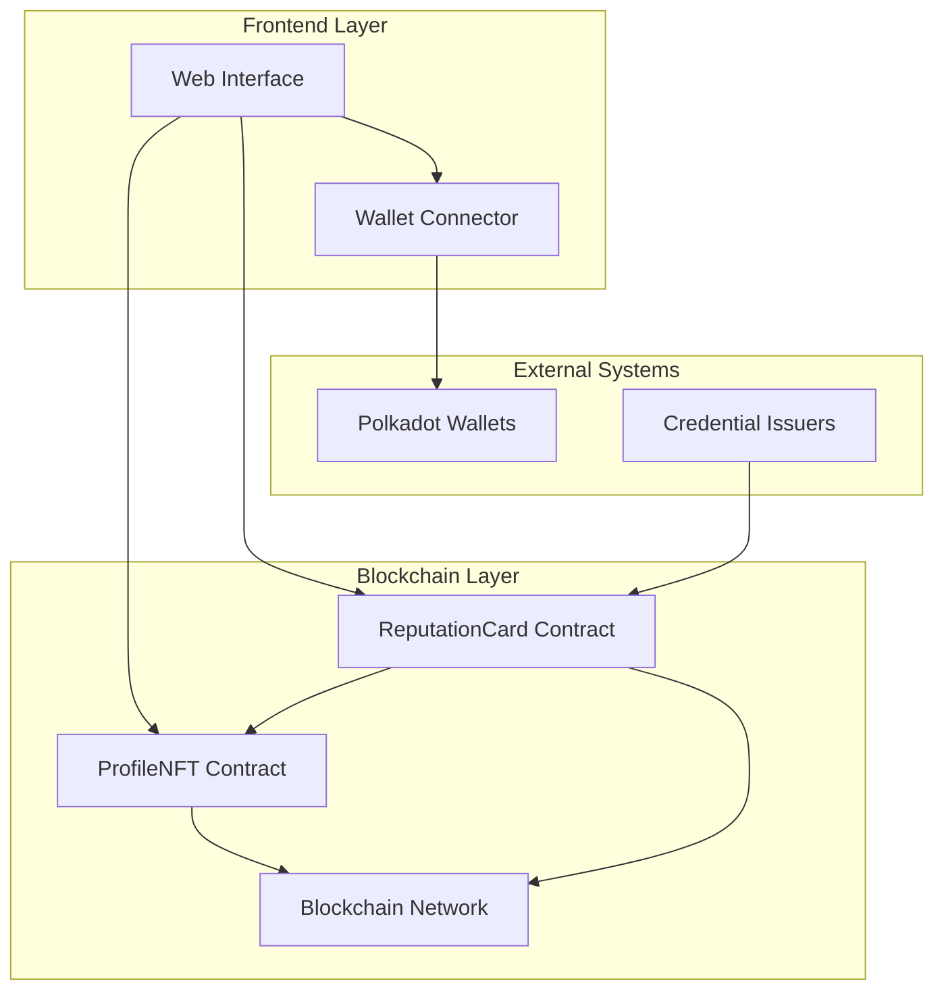
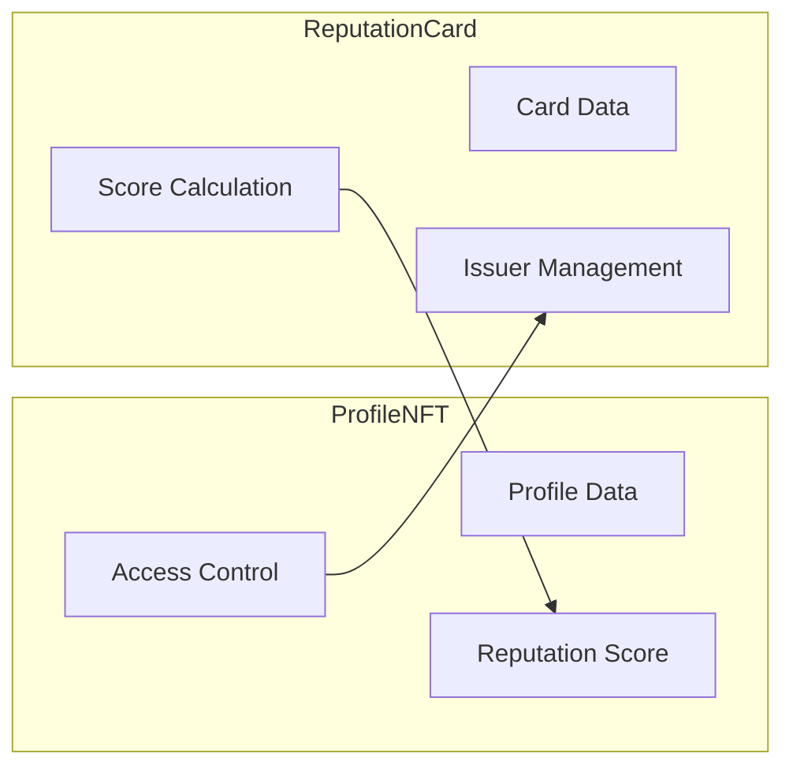
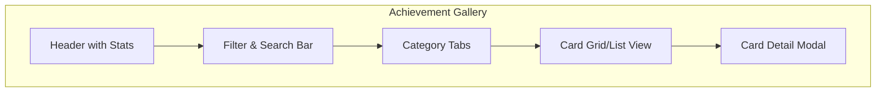
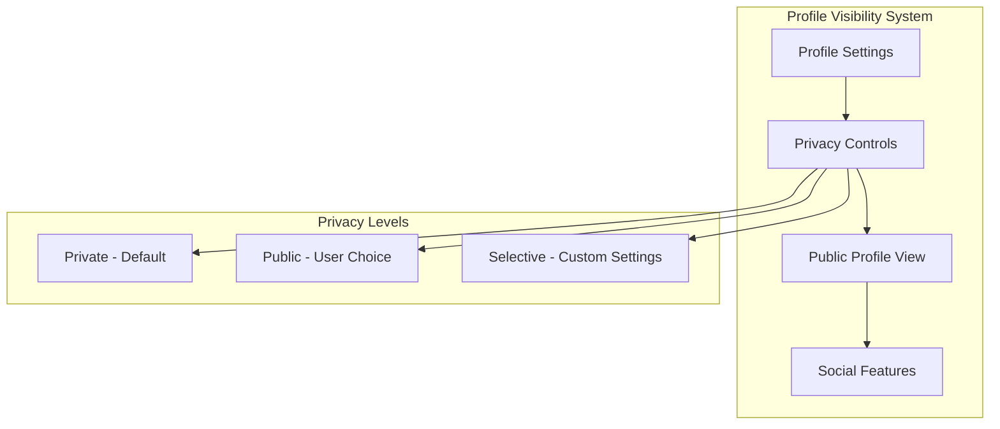
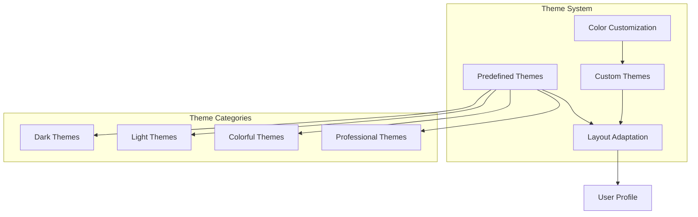

# Design Document

## Overview

The TrustFi System is a decentralized reputation platform built on blockchain technology that enables users to build, verify, and showcase their trustworthiness through verifiable credentials. The system consists of smart contracts for on-chain reputation management and a React-based web interface for user interaction with Polkadot wallets.

The platform uses a dual-NFT architecture where Profile NFTs represent user identities and Reputation Card NFTs represent verifiable achievements. This design ensures immutability, transparency, and decentralized verification of reputation data.

## Architecture

### High-Level Architecture



### Smart Contract Architecture

The system employs two main smart contracts:

1. **ProfileNFT Contract**: Manages user identity and reputation profiles
2. **ReputationCard Contract**: Handles verifiable credentials and reputation scoring



## Components and Interfaces

### Achievement Gallery Design

The Achievement Gallery is the centerpiece of the user experience, providing an intuitive and visually appealing way to showcase reputation cards.

#### Gallery Features
- **Category-Based Organization**: Cards are automatically grouped by their category (e.g., "Education", "Community", "Technical Skills", "Leadership")
- **Visual Card Display**: Each reputation card is displayed as a visually distinct card with category-specific styling
- **Filtering and Sorting**: Users can filter by category, sort by date/value, and search through their achievements
- **Detailed Card View**: Click on any card to see full details including issuer information, description, and verification status
- **Statistics Overview**: Display total achievements, reputation score breakdown by category, and recent activity

#### Gallery Layout


#### Category Management
- **Dynamic Categories**: Categories are derived from issued cards, no predefined list
- **Category Statistics**: Show count and total value per category
- **Visual Distinction**: Each category has unique colors and icons
- **Category Filtering**: Quick filter buttons for each category plus "All" option

### Profile Visibility and Social Features

#### Core Privacy Features
- **Profile Visibility Toggle**: Users can set their profile as public or private
- **Granular Privacy Controls**: Choose what information to display publicly
- **Public Profile URL**: Shareable link for public profiles
- **Privacy-First Design**: All profiles are private by default

#### Public Profile Features
- **Public Achievement Gallery**: View others' achievements when profile is public
- **Profile Information Display**: Show name, bio, and selected statistics
- **Verification Status**: Display verification badges for authentic profiles
- **Responsive Design**: Optimized viewing on all devices

#### Optional Social Features (Lower Priority)
- **Profile Likes**: Allow users to like public profiles
- **View Counter**: Track profile view statistics
- **Profile Discovery**: Browse trending or recently updated public profiles
- **Social Statistics**: Display likes and views count for public profiles



### Profile Customization System (Future Implementation)

#### Visual Customization Features
- **Profile Images**: Upload profile picture and banner image stored on IPFS
- **Theme System**: Multiple predefined themes (Dark, Light, Neon, Professional, etc.)
- **Custom Colors**: User-defined color schemes for personal branding
- **Layout Options**: Different profile layout styles (Compact, Detailed, Showcase)
- **Badge Display**: Prominent display of special achievements and certifications

#### Theme Architecture


#### Customization Storage
- **On-Chain**: Basic theme selection and color preferences
- **IPFS**: Profile and banner images for decentralized storage
- **Local Storage**: UI preferences and temporary customizations
- **Smart Contract Events**: Theme changes for profile history tracking

### Smart Contract Components

#### ProfileNFT Contract
- **Purpose**: Manages unique user profiles as non-transferable NFTs
- **Key Features**:
  - One profile per wallet address
  - Reputation score tracking
  - Profile metadata (name, bio)
  - Authorization system for score updates
- **Interface Methods**:
  - `createProfile(string name, string bio)`: Creates new profile
  - `getProfile(uint256 tokenId)`: Retrieves profile data
  - `updateReputationScore(uint256 tokenId, uint256 newScore)`: Updates score
  - `authorizeContract(address contractAddress)`: Authorizes contracts

#### ReputationCard Contract
- **Purpose**: Issues and manages verifiable reputation credentials
- **Key Features**:
  - Non-transferable credential NFTs
  - Issuer authorization system
  - Automatic reputation score calculation
  - Card revocation capability
- **Interface Methods**:
  - `issueCard(uint256 profileId, string category, string description, uint256 value)`: Issues new card
  - `getCard(uint256 cardId)`: Retrieves card data
  - `verifyCard(uint256 cardId)`: Verifies card authenticity
  - `revokeCard(uint256 cardId)`: Revokes invalid cards

### Frontend Components

#### Web Interface Architecture
- **Technology Stack**: React 19, TypeScript, Vite, TailwindCSS
- **Wallet Integration**: @talismn/connect-wallets for Polkadot support
- **Blockchain Interaction**: ethers.js for contract communication

#### Core Components
1. **WalletConnector**: Handles Polkadot wallet connection and authentication
2. **ProfileManager**: Displays and manages user profile information with privacy settings
3. **AchievementGallery**: Gallery-style display of reputation cards organized by category
4. **CategoryFilter**: Allows filtering and sorting achievements by category
5. **CardViewer**: Detailed view of individual reputation cards with verification status
6. **VerificationSystem**: Validates reputation card authenticity
7. **PublicProfileViewer**: View other users' public profiles and achievements
8. **ProfileSettings**: Manage profile visibility, privacy, and display preferences
9. **AdminPanel**: Manages issuers and system parameters

#### Optional Social Features (Lower Priority)
10. **ProfileDiscovery**: Browse and discover public profiles
11. **SocialInteractions**: Like profiles and view interaction statistics
12. **ProfileSearch**: Search for public profiles by name or achievements

#### Future Profile Customization Features (Later Implementation)
13. **ProfileImageUpload**: Upload and manage profile and banner images via IPFS
14. **ThemeCustomization**: Choose from predefined themes or create custom color schemes
15. **ProfileLayoutCustomizer**: Customize the layout and arrangement of profile elements
16. **BadgeSystem**: Display special badges and achievements prominently
17. **ProfileAnimations**: Add subtle animations and visual effects to profiles

## Data Models

### Profile Data Structure
```typescript
interface Profile {
  name: string;           // Display name (max 50 chars)
  bio: string;            // Biography (max 200 chars)
  reputationScore: number; // Calculated total score
  createdAt: number;      // Creation timestamp
  isActive: boolean;      // Profile status
  isPublic: boolean;      // Profile visibility setting
  likesCount: number;     // Number of likes received (optional feature)
  viewsCount: number;     // Profile view count (optional feature)
  
  // Profile Customization (Future Features)
  profileImage: string;   // IPFS hash or URL for profile image
  bannerImage: string;    // IPFS hash or URL for banner image
  themeId: string;        // Selected theme identifier
  customColors: {         // Custom color scheme
    primary: string;
    secondary: string;
    accent: string;
  };
}
```

### Reputation Card Data Structure
```typescript
interface ReputationCard {
  profileId: number;      // Associated profile ID
  category: string;       // Achievement category (max 50 chars)
  description: string;    // Achievement description (max 200 chars)
  value: number;          // Reputation points (1-1000)
  issuedAt: number;       // Issuance timestamp
  issuer: string;         // Issuer wallet address
  isValid: boolean;       // Revocation status
}
```

### Frontend State Models
```typescript
interface UserState {
  walletAddress: string | null;
  profileId: number | null;
  profile: Profile | null;
  reputationCards: ReputationCard[];
  cardsByCategory: Record<string, ReputationCard[]>;
  selectedCategory: string | null;
  isConnected: boolean;
  profileSettings: ProfileSettings;
}

interface ProfileSettings {
  isPublic: boolean;
  showReputationScore: boolean;
  showAchievementCount: boolean;
  allowProfileLikes: boolean;    // Optional feature
  showViewCount: boolean;        // Optional feature
  
  // Future Customization Settings
  selectedTheme: string;         // Theme identifier
  customization: {
    showBanner: boolean;
    profileLayout: 'compact' | 'detailed' | 'showcase';
    animationsEnabled: boolean;
    customColors: boolean;
  };
}

interface GalleryState {
  viewMode: 'grid' | 'list';
  sortBy: 'date' | 'value' | 'category';
  sortOrder: 'asc' | 'desc';
  searchQuery: string;
  selectedCard: ReputationCard | null;
}

interface PublicProfileState {
  viewedProfile: Profile | null;
  viewedProfileCards: ReputationCard[];
  isLoading: boolean;
}

interface SystemState {
  authorizedIssuers: string[];
  totalProfiles: number;
  totalCards: number;
  availableCategories: string[];
  publicProfiles: Profile[];     // Optional feature
  contractAddresses: {
    profileNFT: string;
    reputationCard: string;
  };
}
```

## Error Handling

### Smart Contract Error Handling
- **Custom Errors**: Use Solidity custom errors for gas efficiency
- **Validation**: Input validation with descriptive error messages
- **Access Control**: Proper authorization checks with specific error types
- **State Consistency**: Atomic operations to prevent inconsistent states

### Frontend Error Handling
- **Wallet Connection Errors**: Handle wallet not found, connection rejected, network mismatch
- **Transaction Errors**: Display user-friendly messages for failed transactions
- **Network Errors**: Retry mechanisms for temporary network issues
- **Validation Errors**: Client-side validation with immediate feedback

### Error Recovery Strategies
1. **Graceful Degradation**: Continue operation when non-critical features fail
2. **Retry Logic**: Automatic retry for transient failures
3. **User Feedback**: Clear error messages with suggested actions
4. **Fallback Options**: Alternative paths when primary operations fail

## Testing Strategy

### Smart Contract Testing
- **Unit Tests**: Test individual contract functions and edge cases
- **Integration Tests**: Test contract interactions and cross-contract calls
- **Security Tests**: Test access controls, reentrancy, and overflow protection
- **Gas Optimization Tests**: Verify efficient gas usage patterns

### Frontend Testing
- **Component Tests**: Test React components in isolation
- **Integration Tests**: Test wallet connection and contract interaction flows
- **E2E Tests**: Test complete user journeys from wallet connection to reputation verification
- **Accessibility Tests**: Ensure WCAG compliance for inclusive design

### Test Environment Setup
- **Local Blockchain**: Use Hardhat network for development testing
- **Test Data**: Predefined test profiles and reputation cards
- **Mock Services**: Mock wallet providers for consistent testing
- **Automated Testing**: CI/CD pipeline with automated test execution

## Security Considerations

### Smart Contract Security
- **Access Control**: Role-based permissions with proper authorization checks
- **Input Validation**: Comprehensive validation of all user inputs
- **Reentrancy Protection**: Use OpenZeppelin's security patterns
- **Integer Overflow**: Use Solidity 0.8+ built-in overflow protection

### Frontend Security
- **Wallet Security**: Secure wallet connection without exposing private keys
- **Data Validation**: Client-side validation with server-side verification
- **XSS Protection**: Proper sanitization of user-generated content
- **HTTPS Only**: Enforce secure connections for all communications

### Privacy Considerations
- **Minimal Data**: Store only necessary information on-chain
- **User Control**: Users control their profile visibility and data sharing
- **Pseudonymous**: Support pseudonymous profiles without requiring real names
- **Data Retention**: Clear policies on data storage and deletion

## Performance Optimization

### Smart Contract Optimization
- **Gas Efficiency**: Optimize contract code for minimal gas consumption
- **Batch Operations**: Support batch processing for multiple operations
- **Storage Optimization**: Efficient data structures and storage patterns
- **Event Indexing**: Proper event emission for efficient querying

### Frontend Optimization
- **Code Splitting**: Lazy loading of components and routes
- **Caching**: Cache contract data and user preferences
- **Optimistic Updates**: Update UI immediately with rollback on failure
- **Connection Pooling**: Efficient blockchain connection management
- **Gallery Performance**: Virtual scrolling for large achievement collections
- **Image Optimization**: Lazy loading and caching of achievement card visuals

## Deployment Strategy

### Smart Contract Deployment
- **Deployment Scripts**: Automated deployment with proper configuration
- **Contract Verification**: Source code verification on block explorers
- **Upgrade Strategy**: Consider proxy patterns for future upgrades
- **Multi-Network**: Support deployment on multiple blockchain networks

### Frontend Deployment
- **Static Hosting**: Deploy React app to CDN for global availability
- **Environment Configuration**: Separate configs for development, staging, production
- **CI/CD Pipeline**: Automated testing and deployment pipeline
- **Monitoring**: Application performance and error monitoring