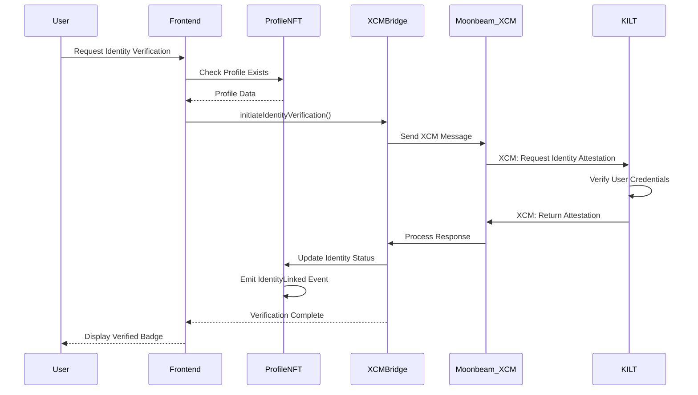

# XCM Identity Integration - Design Document

## Overview

The XCM Identity Integration extends TrustFi's reputation platform to leverage Polkadot's Cross-Consensus Messaging (XCM) protocol for cross-chain identity verification. This design enables reputation NFTs to be linked with verified on-chain identities from other parachains, creating a more robust and interoperable trust network.

### Key Design Goals

1. **Seamless Cross-Chain Communication**: Enable TrustFi to communicate with identity parachains (KILT, Litentry) and Moonbeam via XCM
2. **EVM Compatibility**: Maintain compatibility with existing Ethereum/Hardhat infrastructure while adding Substrate/XCM capabilities
3. **Enhanced Trust**: Link Profile NFTs with verified identities to create higher-value reputation credentials
4. **Hackathon Impact**: Demonstrate real Polkadot interoperability that judges can test and verify

### Architecture Strategy

Since TrustFi is currently built on Hardhat/Ethereum, we'll use **Moonbeam as the bridge parachain** to access XCM functionality while maintaining EVM compatibility. This allows us to:
- Keep existing Solidity contracts with minimal changes
- Access XCM through Moonbeam's precompiled contracts
- Deploy to Moonbeam's testnet (Moonbase Alpha) for hackathon demonstration

## Architecture

### High-Level Architecture

```
┌─────────────────────────────────────────────────────────────┐
│                    TrustFi Frontend (React)                  │
│  - Wallet Connection (MetaMask, Talisman, SubWallet)        │
│  - Identity Verification UI                                  │
│  - Cross-Chain Status Display                               │
└────────────────────┬────────────────────────────────────────┘
                     │
                     ▼
┌─────────────────────────────────────────────────────────────┐
│              Moonbeam Parachain (EVM Compatible)            │
│  ┌──────────────────────────────────────────────────────┐  │
│  │  TrustFi Smart Contracts (Solidity)                  │  │
│  │  - ProfileNFT.sol (Extended)                         │  │
│  │  - ReputationCard.sol (Extended)                     │  │
│  │  - XCMIdentityBridge.sol (New)                       │  │
│  └──────────────────┬───────────────────────────────────┘  │
│                     │                                        │
│  ┌──────────────────▼───────────────────────────────────┐  │
│  │  Moonbeam XCM Precompiles                            │  │
│  │  - XCM Transactor                                    │  │
│  │  - XCM Utils                                         │  │
│  └──────────────────┬───────────────────────────────────┘  │
└────────────────────┬┴───────────────────────────────────────┘
                     │
                     │ XCM Messages
                     │
        ┌────────────┴────────────┐
        │                         │
        ▼                         ▼
┌──────────────────┐    ┌──────────────────┐
│ KILT Protocol    │    │ Litentry         │
│ (Identity Chain) │    │ (Identity Chain) │
│                  │    │                  │
│ - DID Registry   │    │ - Identity       │
│ - Attestations   │    │   Aggregation    │
│ - Credentials    │    │ - Verification   │
└──────────────────┘    └──────────────────┘
```

### Component Interaction Flow



## Components and Interfaces

### 1. XCMIdentityBridge Contract (New)

**Purpose**: Manages XCM communication with identity parachains and coordinates identity verification.

**Key Responsibilities**:
- Send XCM messages to identity parachains
- Process incoming XCM responses
- Manage whitelist of trusted identity parachains
- Store identity verification records
- Interface with ProfileNFT contract

**Interface**:

```solidity
// SPDX-License-Identifier: MIT
pragma solidity ^0.8.20;

interface IXCMIdentityBridge {
    // Structs
    struct IdentityVerification {
        uint32 parachainId;
        bytes32 identityHash;
        uint8 verificationLevel; // 1=Basic, 2=Enhanced, 3=Full KYC
        uint256 verifiedAt;
        bool isActive;
    }
    
    struct ParachainConfig {
        string name;
        bool isWhitelisted;
        address xcmEndpoint;
        uint256 addedAt;
    }
    
    // Core Functions
    function initiateIdentityVerification(
        uint256 profileId,
        uint32 targetParachainId,
        bytes calldata verificationData
    ) external returns (bytes32 requestId);
    
    function processIdentityResponse(
        bytes32 requestId,
        bytes calldata attestationData
    ) external;
    
    function revokeIdentityLink(uint256 profileId) external;
    
    function getIdentityVerification(uint256 profileId) 
        external view returns (IdentityVerification memory);
    
    // Admin Functions
    function addTrustedParachain(
        uint32 parachainId,
        string memory name,
        address xcmEndpoint
    ) external;
    
    function removeTrustedParachain(uint32 parachainId) external;
    
    function getParachainConfig(uint32 parachainId) 
        external view returns (ParachainConfig memory);
    
    // Events
    event IdentityVerificationInitiated(
        uint256 indexed profileId,
        uint32 indexed parachainId,
        bytes32 requestId
    );
    
    event IdentityLinked(
        uint256 indexed profileId,
        uint32 indexed parachainId,
        uint8 verificationLevel,
        bytes32 identityHash
    );
    
    event IdentityRevoked(
        uint256 indexed profileId,
        uint256 revokedAt
    );
    
    event ParachainWhitelisted(
        uint32 indexed parachainId,
        string name
    );
    
    event ParachainRemoved(
        uint32 indexed parachainId
    );
}
```

### 2. ProfileNFT Contract (Extended)

**Extensions Required**:
- Add identity verification status to Profile struct
- Add functions to query verification status
- Integrate with XCMIdentityBridge for updates
- Add verified badge indicator

**Modified Profile Struct**:

```solidity
struct Profile {
    string name;
    string bio;
    uint256 reputationScore;
    uint256 createdAt;
    bool isActive;
    // New fields for XCM identity
    bool hasVerifiedIdentity;
    uint32 identityParachainId;
    uint8 verificationLevel;
    uint256 identityVerifiedAt;
}
```

**New Functions**:

```solidity
function updateIdentityStatus(
    uint256 tokenId,
    bool verified,
    uint32 parachainId,
    uint8 level
) external onlyAuthorized;

function getIdentityStatus(uint256 tokenId) 
    external view returns (
        bool verified,
        uint32 parachainId,
        uint8 level,
        uint256 verifiedAt
    );

function calculateEnhancedReputationScore(uint256 tokenId) 
    external view returns (uint256);
```

### 3. ReputationCard Contract (Extended)

**Extensions Required**:
- Add verification requirement checks
- Allow issuers to set minimum verification levels
- Display verification status in card metadata

**New Functions**:

```solidity
function setMinimumVerificationLevel(uint8 level) external onlyOwner;

function issueCardWithVerification(
    uint256 profileId,
    string memory category,
    string memory description,
    uint256 value,
    uint8 requiredVerificationLevel
) external returns (uint256);
```

### 4. Frontend Integration Layer

**New Components**:

```typescript
// services/xcmIdentityService.ts
interface XCMIdentityService {
    // Initiate identity verification
    requestIdentityVerification(
        profileId: number,
        parachainId: number,
        walletAddress: string
    ): Promise<string>; // returns requestId
    
    // Check verification status
    getVerificationStatus(profileId: number): Promise<IdentityStatus>;
    
    // Revoke identity link
    revokeIdentity(profileId: number): Promise<void>;
    
    // Get supported identity parachains
    getSupportedParachains(): Promise<ParachainInfo[]>;
}

// components/IdentityVerificationWidget.tsx
interface IdentityVerificationWidgetProps {
    profileId: number;
    onVerificationComplete: (status: IdentityStatus) => void;
}
```

## Data Models

### Identity Verification Record

```solidity
struct IdentityVerification {
    uint32 parachainId;           // Source parachain (e.g., 2086 for KILT)
    bytes32 identityHash;         // Hash of identity data
    uint8 verificationLevel;      // 1=Basic, 2=Enhanced, 3=Full KYC
    uint256 verifiedAt;           // Timestamp
    bool isActive;                // Can be revoked
}
```

### XCM Message Format

**Outgoing (TrustFi → Identity Chain)**:

```typescript
interface IdentityVerificationRequest {
    version: number;              // XCM version
    sender: string;               // Moonbeam address
    profileId: number;            // TrustFi Profile NFT ID
    walletAddress: string;        // User's wallet
    requestedLevel: number;       // Verification level requested
    timestamp: number;
    signature: string;            // User signature
}
```

**Incoming (Identity Chain → TrustFi)**:

```typescript
interface IdentityAttestationResponse {
    version: number;
    requestId: string;
    profileId: number;
    verified: boolean;
    verificationLevel: number;
    identityHash: string;         // Hash of verified identity
    attestationProof: string;     // Cryptographic proof
    timestamp: number;
    parachainSignature: string;
}
```

### Enhanced Reputation Score Calculation

```solidity
function calculateEnhancedScore(uint256 baseScore, uint8 verificationLevel) 
    internal pure returns (uint256) 
{
    // Base score multiplier based on verification level
    if (verificationLevel == 0) return baseScore;
    if (verificationLevel == 1) return baseScore * 110 / 100; // +10%
    if (verificationLevel == 2) return baseScore * 125 / 100; // +25%
    if (verificationLevel == 3) return baseScore * 150 / 100; // +50%
    return baseScore;
}
```

## Error Handling

### Contract-Level Errors

```solidity
error ParachainNotWhitelisted(uint32 parachainId);
error ProfileNotFound(uint256 profileId);
error IdentityAlreadyLinked(uint256 profileId);
error InvalidVerificationData();
error UnauthorizedXCMSender();
error VerificationExpired();
error InsufficientVerificationLevel(uint8 required, uint8 actual);
```

### Frontend Error Handling

```typescript
enum IdentityVerificationError {
    WALLET_NOT_CONNECTED = 'WALLET_NOT_CONNECTED',
    PROFILE_NOT_FOUND = 'PROFILE_NOT_FOUND',
    PARACHAIN_UNAVAILABLE = 'PARACHAIN_UNAVAILABLE',
    VERIFICATION_FAILED = 'VERIFICATION_FAILED',
    TRANSACTION_REJECTED = 'TRANSACTION_REJECTED',
    NETWORK_ERROR = 'NETWORK_ERROR'
}

class IdentityVerificationService {
    async handleVerificationError(error: Error): Promise<UserFriendlyError> {
        // Map technical errors to user-friendly messages
        // Provide retry mechanisms
        // Log for debugging
    }
}
```

### XCM Message Failure Handling

```solidity
// Store failed requests for retry
mapping(bytes32 => FailedRequest) private _failedRequests;

struct FailedRequest {
    uint256 profileId;
    uint32 parachainId;
    uint256 attemptedAt;
    uint8 retryCount;
    string failureReason;
}

function retryFailedVerification(bytes32 requestId) external {
    // Implement retry logic with exponential backoff
}
```

## Testing Strategy

### Unit Tests

**Smart Contract Tests** (Hardhat):

```typescript
describe("XCMIdentityBridge", () => {
    describe("Identity Verification", () => {
        it("should initiate identity verification request");
        it("should process valid attestation response");
        it("should reject attestation from non-whitelisted parachain");
        it("should update ProfileNFT with verification status");
        it("should emit IdentityLinked event");
    });
    
    describe("Parachain Management", () => {
        it("should add trusted parachain");
        it("should remove parachain");
        it("should prevent non-owner from managing parachains");
    });
    
    describe("Identity Revocation", () => {
        it("should allow user to revoke identity link");
        it("should update reputation score after revocation");
    });
});

describe("ProfileNFT Extensions", () => {
    it("should store identity verification data");
    it("should calculate enhanced reputation score");
    it("should display verified badge status");
});
```

### Integration Tests

**Cross-Contract Integration**:

```typescript
describe("XCM Identity Integration", () => {
    it("should complete full verification flow");
    it("should update reputation score with verification bonus");
    it("should enforce verification requirements for high-value cards");
    it("should handle verification revocation");
});
```

### XCM Message Testing

**Mock XCM Responses**:

```typescript
describe("XCM Message Handling", () => {
    it("should parse valid attestation response");
    it("should reject malformed XCM messages");
    it("should handle timeout scenarios");
    it("should verify cryptographic proofs");
});
```

### Frontend Tests

**Component Tests** (React Testing Library):

```typescript
describe("IdentityVerificationWidget", () => {
    it("should display verification button for unverified profiles");
    it("should show verification status for verified profiles");
    it("should handle verification initiation");
    it("should display loading state during verification");
    it("should show error messages on failure");
});
```

### End-to-End Tests

**Hackathon Demo Scenarios**:

```typescript
describe("Hackathon Demo Flow", () => {
    it("should complete identity verification on Moonbase Alpha");
    it("should display verified badge in UI");
    it("should show enhanced reputation score");
    it("should issue high-value card to verified profile");
});
```

## Deployment Strategy

### Phase 1: Local Development
- Deploy to Hardhat local network
- Mock XCM responses for testing
- Develop and test all contract functionality

### Phase 2: Moonbase Alpha Testnet
- Deploy contracts to Moonbase Alpha (Moonbeam testnet)
- Configure XCM connections to testnet identity parachains
- Test real XCM message flow

### Phase 3: Hackathon Demo
- Deploy production-ready contracts
- Set up demo accounts with pre-verified identities
- Prepare live demonstration flow
- Create video walkthrough

### Deployment Configuration

```typescript
// hardhat.config.ts
const config: HardhatUserConfig = {
    networks: {
        moonbaseAlpha: {
            url: 'https://rpc.api.moonbase.moonbeam.network',
            chainId: 1287,
            accounts: [process.env.PRIVATE_KEY]
        }
    },
    // XCM Configuration
    xcm: {
        parachains: {
            kilt: {
                id: 2086,
                endpoint: 'wss://spiritnet.kilt.io'
            },
            litentry: {
                id: 2013,
                endpoint: 'wss://rpc.litentry-parachain.litentry.io'
            }
        }
    }
};
```

## Security Considerations

### 1. XCM Message Validation
- Verify sender parachain ID against whitelist
- Validate cryptographic signatures on attestations
- Implement replay attack prevention
- Use nonces for request tracking

### 2. Access Control
- Only authorized contracts can update identity status
- Profile owners control identity linking/revocation
- Admin-only parachain whitelist management

### 3. Data Privacy
- Store only identity hash, not raw identity data
- Allow users to revoke identity links
- Implement data minimization principles

### 4. Smart Contract Security
- Reentrancy guards on state-changing functions
- Input validation on all external calls
- Emergency pause functionality
- Upgrade path for bug fixes

## Performance Optimization

### Gas Optimization
- Batch XCM messages when possible
- Use events for off-chain data storage
- Optimize struct packing
- Minimize storage writes

### XCM Message Efficiency
- Compress verification data
- Use efficient encoding (SCALE codec)
- Implement message batching
- Cache parachain configurations

## Hackathon Demonstration Plan

### Demo Flow

1. **Setup** (Pre-demo):
   - Deploy contracts to Moonbase Alpha
   - Configure KILT testnet connection
   - Create demo accounts

2. **Live Demo**:
   - Show unverified profile with base reputation
   - Initiate identity verification via UI
   - Display XCM message being sent (block explorer)
   - Show attestation response from KILT
   - Display verified badge and enhanced score
   - Issue high-value reputation card (requires verification)

3. **Technical Deep Dive**:
   - Show smart contract code
   - Explain XCM message structure
   - Demonstrate cross-chain query
   - Show event logs

### Judging Criteria Alignment

- **Innovation**: First reputation system with XCM identity integration
- **Technical Complexity**: Real XCM implementation, not just concept
- **Polkadot Integration**: Leverages core Polkadot technology (XCM)
- **Usability**: Clean UI, smooth user experience
- **Completeness**: Full working demo on testnet

## Future Enhancements

### Post-Hackathon Roadmap

1. **Multi-Chain Support**:
   - Support multiple identity parachains simultaneously
   - Aggregate verification scores from different sources

2. **Advanced Verification Levels**:
   - Biometric verification integration
   - Government ID verification
   - Social media attestations

3. **Cross-Chain Reputation Portability**:
   - Export reputation to other parachains
   - Use TrustFi reputation in other dApps

4. **Decentralized Governance**:
   - Community voting on trusted parachains
   - Reputation-weighted governance

## Technical Dependencies

### Required Packages

```json
{
  "dependencies": {
    "@polkadot/api": "^10.11.1",
    "@polkadot/util": "^12.6.1",
    "@polkadot/util-crypto": "^12.6.1",
    "moonbeam-types-bundle": "^2.0.9",
    "@moonbeam-network/xcm-sdk": "^2.1.0"
  }
}
```

### Moonbeam XCM Precompiles

- **XCM Transactor**: `0x0000000000000000000000000000000000000806`
- **XCM Utils**: `0x0000000000000000000000000000000000000808`

### Identity Parachain Endpoints

- **KILT Spiritnet**: `wss://spiritnet.kilt.io`
- **Litentry**: `wss://rpc.litentry-parachain.litentry.io`

## Documentation Requirements

### For Hackathon Submission

1. **README.md**: Setup instructions, demo guide
2. **ARCHITECTURE.md**: Technical architecture overview
3. **XCM_INTEGRATION.md**: XCM implementation details
4. **DEMO_GUIDE.md**: Step-by-step demo walkthrough
5. **VIDEO**: 3-5 minute demo video
6. **SLIDES**: Technical presentation deck

### Code Documentation

- Comprehensive NatSpec comments
- Inline XCM message format documentation
- Frontend component documentation
- API documentation for services
